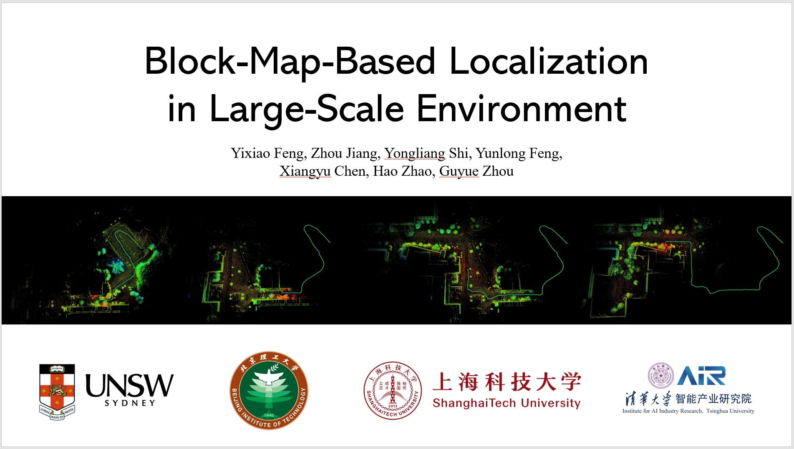

<div align="center">
    <h1>BM-Loc</h1>
    <br />
    <a href=https://www.youtube.com/watch?v=jJhs0jK-uSI>🎬Video</a>
    <span>&nbsp;&nbsp;•&nbsp;&nbsp;</span>
    <a href="https://github.com/YixFeng/Block-Map-Based-Localization/blob/main/README.md#Installation">🛠️Installation</a>
    <span>&nbsp;&nbsp;•&nbsp;&nbsp;</span>
    <a href=https://arxiv.org/pdf/2404.18192>📑Paper</a>
  <br />
  <br />
</div>



In this work, we propose a <strong>Block Map (BM)</strong> generation and maintenance method and the corresponding BM-based localization system. The main contributions are as follows:

- A BM-based localization system in a large-scale environment is proposed for the first time.
- A BM generation method and corresponding switching strategy is proposed which maintains the spatial continuity of adjacent BMs.
- A factor graph-based optimization method with the dynamic sliding window based on BMs is proposed to achieve accurate and reliable state estimation.
- We achieve the best performance on publicly available large-scale datasets [NCLT](https://robots.engin.umich.edu/nclt/) and [M2DGR](https://github.com/SJTU-ViSYS/M2DGR).


***
## Installation
### 1. Prerequisites
#### 1.1 Ubuntu and ROS
Ubuntu $\geq$ 18.04
#### 1.2 ROS Package
- [ndt_omp](https://github.com/koide3/ndt_omp)
- [fast_gicp](https://github.com/SMRT-AIST/fast_gicp)
- [hdl_global_localization](https://github.com/koide3/hdl_global_localization) (Can be replaced by our promoted global localization method; will release soon)

### 2. Build
```bash
cd <your workspace>/src
git clone https://github.com/koide3/ndt_omp
git clone https://github.com/SMRT-AIST/fast_gicp --recursive
git clone https://github.com/koide3/hdl_global_localization
git clone https://github.com/YixFeng/Block-Map-Based-Localization

cd ..
catkin_make
source devel/setup.bash
```

## Run
We provide some [Block Maps](https://drive.google.com/file/d/1Z2K56jTkMOouZhM4c9JhPvqyDxGFiXSY/view?usp=drive_link) (Google Drive) to make your tests easy. 

- **M2DGR street_01**
  


- **M2DGR street_02**


### 1. NCLT
Download NCLT from [https://robots.engin.umich.edu/nclt/](https://robots.engin.umich.edu/nclt/)
```bash
roslaunch block_localization run_nclt.launch
```

### 2. M2DGR
Download M2DGR from [https://github.com/SJTU-ViSYS/M2DGR](https://github.com/SJTU-ViSYS/M2DGR)
```bash
roslaunch block_localization run_m2dgr.launch
```
*Remarks:*
Since BM-Loc is a map-based localization method, you need to provide the directory where maps are stored. Edit the parameter `globalmap_dir` in `config/*.yaml` files. 


## Citation
If you use any of this code, please cite our [paper](https://arxiv.org/pdf/2404.18192).

```bibtex
@article{feng2024block,
  title={Block-Map-Based Localization in Large-Scale Environment},
  author={Feng, Yixiao and Jiang, Zhou and Shi, Yongliang and Feng, Yunlong and Chen, Xiangyu and Zhao, Hao and Zhou, Guyue},
  journal={arXiv preprint arXiv:2404.18192},
  year={2024}
}
```

## Acknowledgements
Thanks for the open-source projects [hdl_localization](https://github.com/koide3/hdl_localization), [hdl_global_localization](https://github.com/koide3/hdl_localization) and [LIO-SAM](https://github.com/TixiaoShan/LIO-SAM).

## Star History

[](https://www.star-history.com/#YixFeng/Block-Map-Based-Localization&Date)
